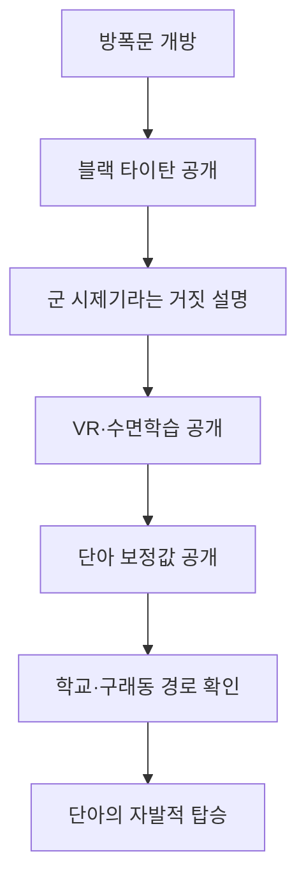

# Project Black Titan — EP002 「격납고」 Gate C 승인서 v1.0

| 항목 | 내용 |
| --- | --- |
| 심사 대상 | `Black_Titan_EP002_회차브리프_v1.0_GateC승인.md` |
| 진입 상태 | SNAP-001 v1.1 `APPROVED_CURRENT_STATE` |
| 상위 승인 | 통합설정집 v2.3, 전체 플롯 v2.2, 봄 Level 3 v3.2, S1 v3.7 |
| 현행 정정 | G0-006 — VR 첫 설명은 EP2, 시력과의 직접 인과 금지, 수면학습 복원 |
| 현재 판정 | **`GATE_C_PASS` — 2026-08-01 사용자 승인** |

## 1. Gate C 검증

| 분류 | 결과 | 근거 |
| --- | --- | --- |
| ENTRY | **PASS** | EP1 마지막 방폭문 동작에서 끊김 없이 시작한다. |
| A-LANE | **PASS** | 블랙 타이탄 공개, 출격 압박, 단아의 자발적 선택이 한 회 안에서 완료된다. |
| B3-SUA | **PASS** | 수아는 자신도 같은 수면학습·놀이형 훈련을 받았다고 연결하지만 적합성·동조·파일럿 가능성은 증명되지 않는다. |
| C2-DISCLOSURE | **PASS** | 군 재난대응 시제기·불법 반출은 가족용 거짓 설명으로만 제시되고 실제 기원은 봉인된다. |
| VR-TIMING | **PASS** | EP1에는 VR 설명이 없고, EP2에서 5개월 전 VR이 조종 보정 시험이었다는 사실을 처음 공개한다. |
| VISION-FORESHADOW | **PASS** | `지난가을 시력 저하`와 `5개월 전 VR`의 시기만 맞물린다. 단아가 안경을 한 번 밀어 올리는 행동 외에 인과를 대사·해설·사과로 연결하지 않는다. |
| SLEEP-LEARNING | **PASS** | 수면학습·놀이형 반복 훈련이 조종 절차를 각인했다는 기존 정사를 복원하고, 마지막 손동작으로 효과를 증명한다. |
| NAMING | **PASS** | 가족 내부 세 사람만 `블랙 타이탄`을 안다. 외부 인물은 등장하지 않는다. |
| CONTROL | **PASS** | 기본동작은 운동의도 변환, 접촉·부하는 감쇠 포스 피드백이다. 조종간은 외부무장 전용이고 현재 무장은 없다. |
| CHOICE | **PASS** | 영진의 명령 자체가 아니라 학교·구래동의 위험을 확인한 뒤 단아가 선택한다. |
| PACING | **PASS** | `공개→거짓 출처→숨은 훈련→선택`의 네 전환으로 정보 장면을 행동과 이동에 분산한다. |
| HOOK | **PASS** | 첫 기동·전투를 선취하지 않고 신체기억이 드러나는 손동작에서 끝난다. |
| FIREWALL | **PASS** | 현행 정본·승인 개요·SNAP-001만 사건 근거로 사용했다. 문체 검색은 Gate C 승인 뒤로 미뤘다. |

## 2. 핵심 인과

## 3. 사용자 확인 지점

Gate C에서 잠글 판단은 세 가지다.

1. 2화의 중심 갈등을 `기체 정체`보다 **아이에게 출격을 요구하는 영진과
   그 요구를 자기 선택으로 바꾸는 단아**에 둔다.
2. 영진의 위장 설명은 네 문단짜리 강의가 아니라 격납고 이동·기동 준비 중
   수아와 단아의 질문에 끊어 답하는 방식으로 쓴다.
3. 엔딩은 발진이나 첫걸음이 아니라 **처음 보는 스위치를 먼저 찾는 손**에서
   멈춘다. 영진의 설명을 반복하지 않고 수면학습이 실제로 몸에 남았음을 행동으로
   확인한 뒤 EP3 첫 전투로 넘긴다.

추가 공개수위 잠금:

- EP2에서 `VR`과 `조종 보정`은 처음 연결한다.
- `VR`과 `시력 저하`는 연결하지 않는다.
- 시기 병치와 안경을 밀어 올리는 행동만 허용한다.

세 지점과 추가 공개수위는 2026-08-01 사용자 지시 `좋아 다음으로 가자`로
승인됐다. 브리프 v1.0을 `GATE_C_PASS`로 잠그고 Level 6 내용 잠금·문체
검색 단계로 진입한다.
